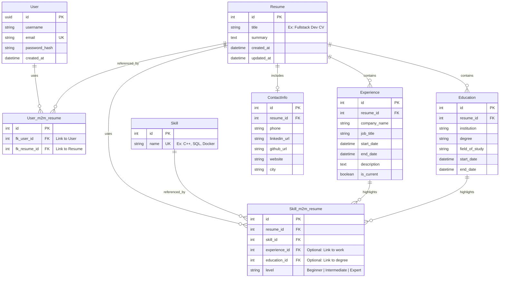

```mermaid
erDiagram
    %% Many-to-Many Relationships for Resume Ownerships
    User ||--o{ User_m2m_resume : uses
    Resume ||--o{ User_m2m_resume : referenced_by

    Resume ||--o{ Experience : contains
    Resume ||--o{ Education : contains
    Resume ||--o| ContactInfo : includes

    %% Many-to-Many Relationships for Skills
    Resume ||--o{ Skill_m2m_resume : uses
    Skill ||--o{ Skill_m2m_resume : referenced_by
    Experience ||--o{ Skill_m2m_resume : highlights
    Education ||--o{ Skill_m2m_resume : highlights

    User {
        uuid id PK
        string username
        string email UK
        string password_hash
        datetime created_at
    }

    Resume {
        int id PK
        string title "Ex: Fullstack Dev CV"
        text summary
        datetime created_at
        datetime updated_at
    }

    User_m2m_resume {
        int id PK
        int fk_user_id FK "Link to User"
        int fk_resume_id FK "Link to Resume"
    }

    ContactInfo {
        int id PK
        int resume_id FK
        string phone
        string linkedin_url
        string github_url
        string website
        string city
    }

    Experience {
        int id PK
        int resume_id FK
        string company_name
        string job_title
        datetime start_date
        datetime end_date
        text description
        boolean is_current
    }

    Education {
        int id PK
        int resume_id FK
        string institution
        string degree
        string field_of_study
        datetime start_date
        datetime end_date
    }

    Skill {
        int id PK
        string name UK "Ex: C++, SQL, Docker"
    }

    Skill_m2m_resume {
        int id PK
        int resume_id FK
        int skill_id FK
        int experience_id FK "Optional: Link to work"
        int education_id FK "Optional: Link to degree"
        string level "Beginner | Intermediate | Expert"
    }
```