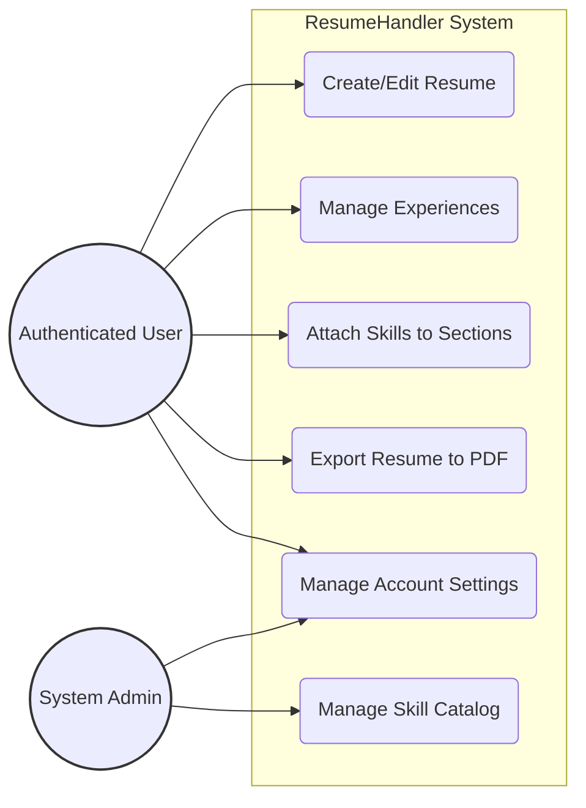

```mermaid
graph LR
    %% Actors
    User((Authenticated User))
    Admin((System Admin))

    subgraph "ResumeHandler System"
        UC1(Create/Edit Resume)
        UC2(Manage Experiences)
        UC3(Attach Skills to Sections)
        UC4(Export Resume to PDF)
        UC5(Manage Account Settings)
        UC6(Manage Skill Catalog)
    end

    %% Relationships
    User --> UC1
    User --> UC2
    User --> UC3
    User --> UC4
    User --> UC5

    Admin --> UC6
    Admin --> UC5

    %% Styling
    style User fill:#ff,stroke:#333,stroke-width:2px
    style Admin fill:#ff,stroke:#333,stroke-width:2px
```