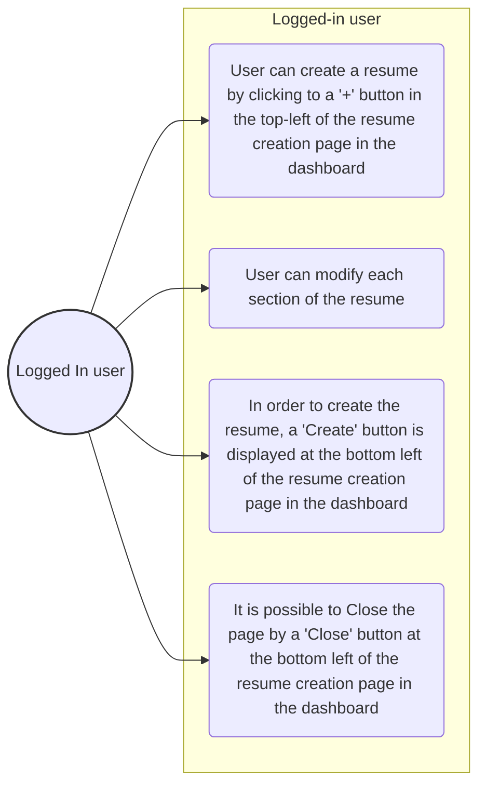

```mermaid
graph LR
    %% Actor
    User((Logged In user))

    %% Use-cases
    subgraph "Logged-in user"
        UC-C1("User can create a resume by clicking to a '+' button in the top-left of the resume creation page in the dashboard")
        UC-C2("User can modify each section of the resume")
        UC-C3("In order to create the resume, a 'Create' button is displayed at the bottom left of the resume creation page in the dashboard")
        UC-C4("It is possible to Close the page by a 'Close' button at the bottom left of the resume creation page in the dashboard")
    end

    %% Relationship
    User --> UC-C1
    User --> UC-C2
    User --> UC-C3
    User --> UC-C4

    %% Styling
    style User fill:#ff,stroke:#333,stroke-width:2px
```