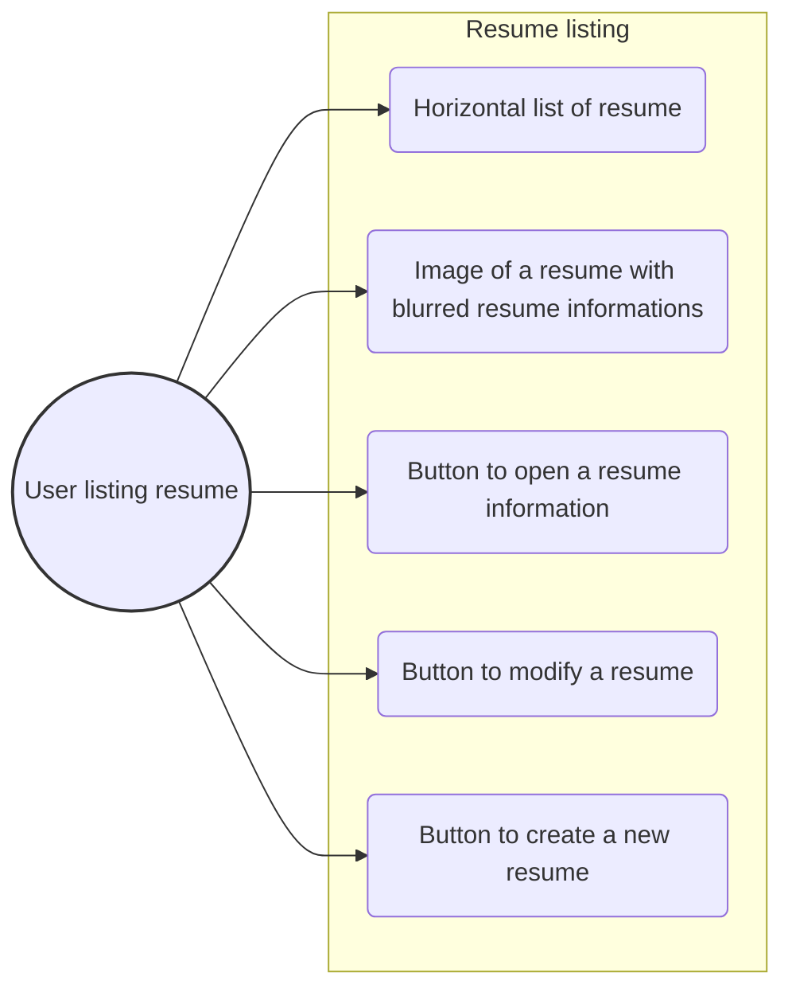

```mermaid
graph LR
    %% Actor
    User((User listing resume))

    %% Use-cases
    subgraph "Resume listing"
        UC-L1("Horizontal list of resume")
        UC-L2("Image of a resume with blurred resume informations")
        UC-L3("Button to open a resume information")
        UC-L4("Button to modify a resume")
        UC-L5("Button to create a new resume")
    end

    %% Relationships
    User --> UC-L1
    User --> UC-L2
    User --> UC-L3
    User --> UC-L4
    User --> UC-L5
    
    %% Styling
    style User fill:#ff,stroke:#333,stroke-width:2px
```