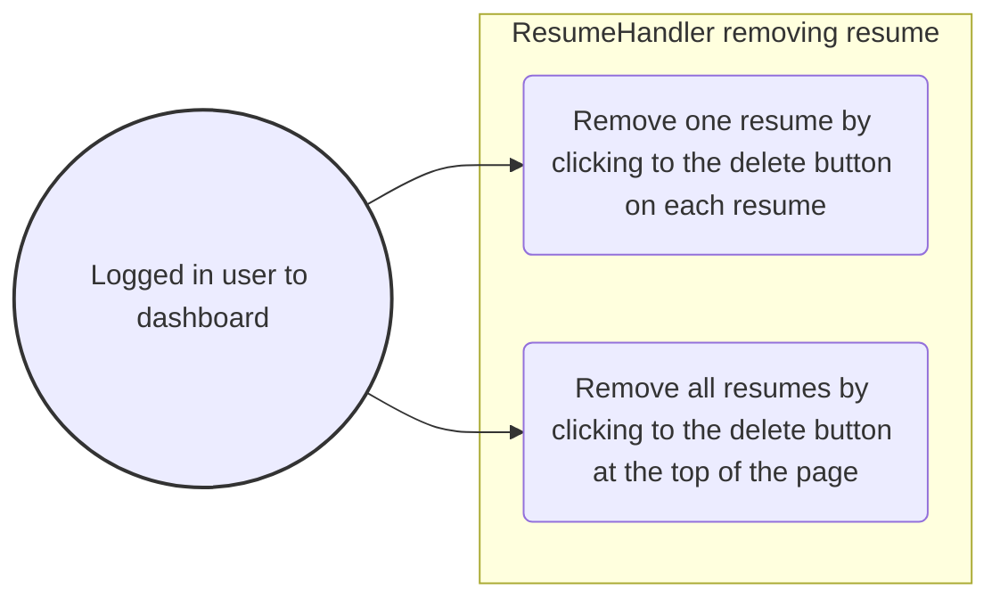

```mermaid
graph LR
    %% Actor
    User((Logged in user to dashboard))

    subgraph "ResumeHandler removing resume"
        UC1("Remove one resume by clicking to the delete button on each resume")
        UC2("Remove all resumes by clicking to the delete button at the top of the page")
    end

    %% Relationships
    User --> UC1
    User --> UC2

    %% Styling
    style User fill:#ff,stroke:#333,stroke-width:2px
```