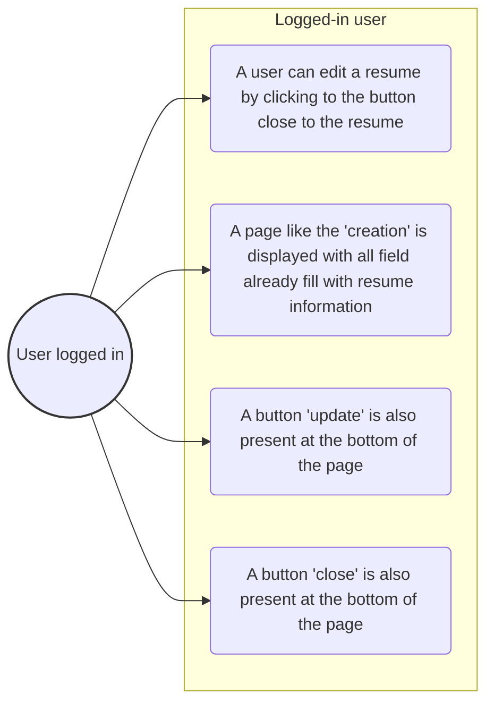

```mermaid
graph LR
    %% Actor
    User((User logged in))

    %% Use-cases
    subgraph "Logged-in user"
        UC-C1("A user can edit a resume by clicking to the button close to the resume")
        UC-C2("A page like the 'creation' is displayed with all field already fill with resume information")
        UC-C3("A button 'update' is also present at the bottom of the page")
        UC-C4("A button 'close' is also present at the bottom of the page")
    end

    %% Relationships
    User --> UC-C1
    User --> UC-C2
    User --> UC-C3
    User --> UC-C4

    %% Styling
    style User fill:#ff,stroke:#333,stroke-width:2px
```