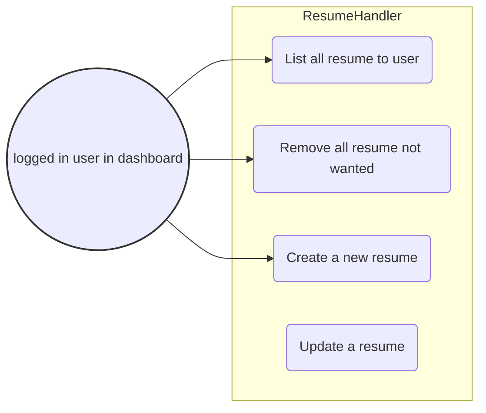

```mermaid
graph LR
    %% Actor
    User((logged in user in dashboard))

    %% DB = DashBoard
    subgraph "ResumeHandler"
        UC-DB1("List all resume to user")
        UC-DB2("Remove all resume not wanted")
        UC-DB3("Create a new resume")
        UC-DB4("Update a resume")
    end

    %% Relationships
    User --> UC-DB1
    User --> UC-DB2
    User --> UC-DB3

    %% Styling
    style User fill:#ff,stroke:#333,stroke-width:2px
```