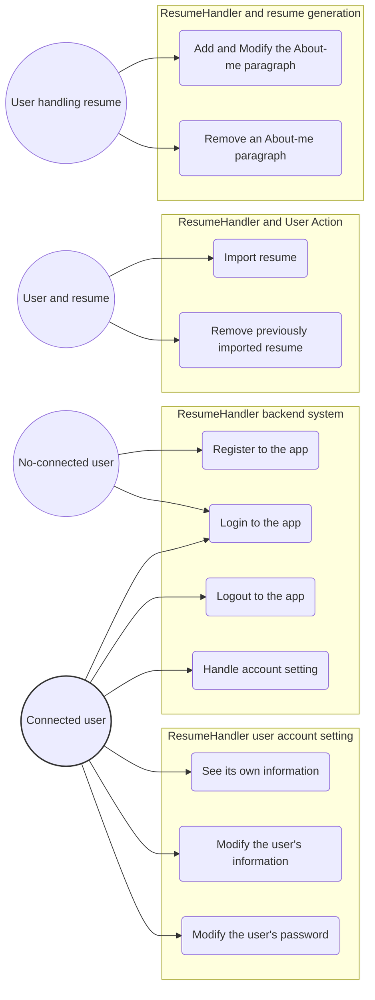

```mermaid
graph LR
    %% Actors
    Anonymous((No-connected user))
    UserC((Connected user))
    UserD((User and resume))
    UserF((User handling resume))
    

    subgraph "ResumeHandler backend system"
        UC-BE1(Register to the app)
        UC-BE2(Login to the app)
        UC-BE3(Logout to the app)
        UC-BE4(Handle account setting)
    end

    subgraph "ResumeHandler user account setting"
        UC-SET1("See its own information")
        UC-SET2("Modify the user's information")
        UC-SET3("Modify the user's password")
    end

    subgraph "ResumeHandler and User Action"
        UC-CTA1("Import resume")
        UC-CTA2("Remove previously imported resume")
    end

    subgraph "ResumeHandler and resume generation"
        UC-RESUME1("Add and Modify the About-me paragraph")
        UC-RESUME2("Remove an About-me paragraph")
    end

    %% Relationships
    Anonymous --> UC-BE1
    Anonymous --> UC-BE2
    UserC --> UC-BE2
    UserC --> UC-BE3
    UserC --> UC-BE4
    UserC --> UC-SET1
    UserC --> UC-SET2
    UserC --> UC-SET3
    UserD --> UC-CTA1
    UserD --> UC-CTA2
    UserF --> UC-RESUME1
    UserF --> UC-RESUME2

    %% Styling
    style UserC fill:#ff,stroke:#333,stroke-width:2px
```